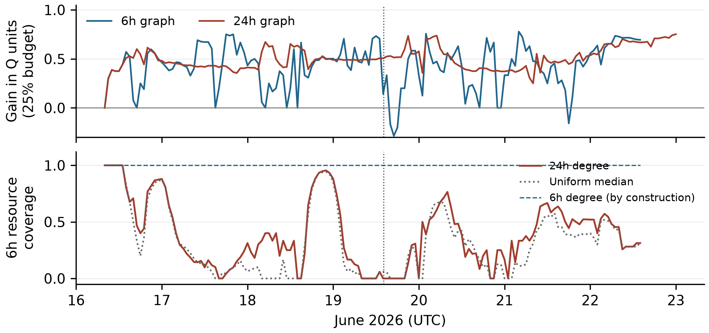
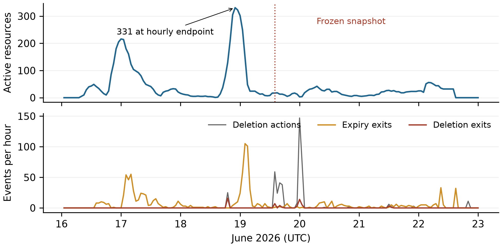
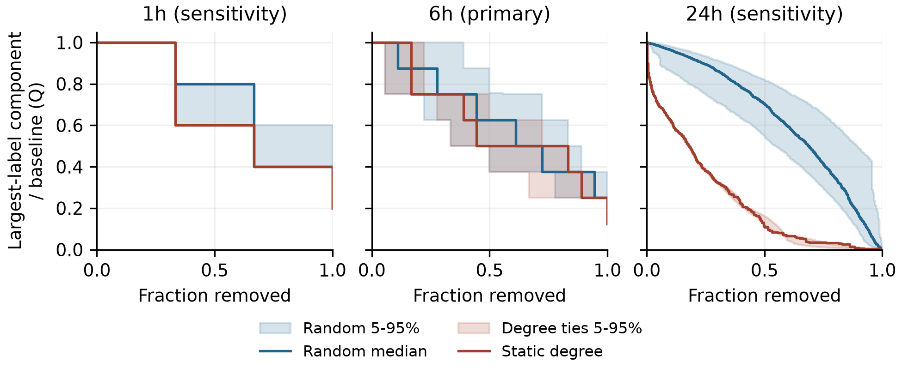
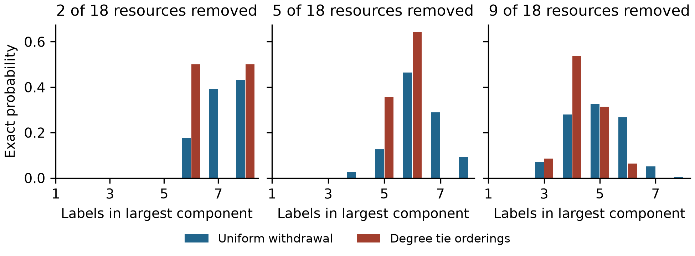

# SwarmTrace: Auditing Temporal Mismatch in Resource Targeting During the DSEWiki Incident

Author: Yazan Al-Dabain
With: Apart Research
Status: Submission version

## Abstract

SwarmTrace audits how an activity window changes the interpretation of resource targeting in the DSEWiki incident. I reconstruct resource lifecycles and recent co-writing from archived revisions and deletion events, then compare static degree targeting with uniform withdrawal. The locally frozen six-hour snapshot has 18 resources and 27 labels and shows no consistent degree advantage. An exploratory survey finds an advantage at a 25% budget in 138 of 151 nonempty hourly snapshots. A separate comparison holds candidates and the six-hour evaluation graph fixed. At the frozen time, the first 18 resources ranked by 24-hour degree include none of the 18 recent resources. Their withdrawal reduces the older graph's largest-label component from 782 to 545 while leaving recent connectivity unchanged. Complete misses occur at 20 of 151 hours under every valid degree-tie ordering; uniform withdrawal would produce 29.0 such hours in expectation. Miss counts therefore do not show that degree targeting is worse than random. The contribution is an auditable separation of historical fragmentation, recent-resource coverage and deletion accounting. These structural measurements do not establish information loss or containment.

## 1. Introduction

The DSEWiki investigation reports agents sharing answers on public infrastructure and reacting to moderator cleanup [1]. A deletion can target a page with no recent writers, and a historical hub can be absent from the current multi-writer surface. Deletion totals and fragmentation of an accumulated graph do not distinguish these cases.

SwarmTrace reconstructs resource episodes and recent co-writing, preserves a locally frozen withdrawal test, and audits targeting across time. Holding candidates, action counts and the evaluation graph fixed separates a ranking's historical fragmentation from its coverage of recent overlap. The artifact makes those definitions and their source records inspectable.

## 2. Related Work

The incident account [1] and ProWiki export [2] supply the evidence. Targeted versus random removal is an established robustness comparison [3], and temporal-network research explains why static connectivity need not represent time-respecting flow [4]. Lee et al. [5] use contact recency for immunization and evaluate on later contacts and simulated outbreaks. Williams and Musolesi [6] distinguish topological, temporal and spatial disruption under node failure. These works already establish that timing and endpoint choice matter. SwarmTrace contributes an incident-specific resource audit with deletion and expiry accounting and a controlled comparison of activity windows. It neither introduces a temporal centrality nor evaluates future transmission.

<!-- pagebreak -->

## 3. Methods

**Data and identity.** The pinned explorer-schema-2 export [2] matches five frozen SHA-256 hashes. DSEWiki supplies 13,403 revisions and 5,217 successful deletions. The frozen actor rule excludes 26 revisions matching [Admin1] and IP /16 2.202, plus five ambiguous-handle revisions. No revision lacks a label; 13,372 qualify. Labels are identifiers, not authenticated agents. Save-event pointers are not additional writes.

**Historical reconstruction.** The replay initializes from available prehistory and reports [June 16 00:00, June 23 00:00) UTC. A successful deletion clears a represented page episode; a subsequent write starts a new episode without inherited writers. Unmatched deletions remain in a separate ledger. An incidence is live when its latest qualifying write lies in (t-W,t], with expiry before same-second source events. At least two live labels make a resource multi-writer. I count entries, deletion exits and expiry exits. W=6h is primary; 1h and 24h were frozen sensitivities.

**Frozen withdrawal test.** The snapshot is immediately before June 19, 2026, 14:05:02 UTC. It excludes events at T and includes writes in [T-W,T). T coincides with the published cleanup-warning revision [1], which is excluded. The unweighted bipartite graph joins qualifying labels to eligible resource episodes. I rank resources once by distinct-label degree, breaking ties lexicographically by page key and episode. At each action count, I compare this ordering with 500 seeded uniform permutations and separately assess 500 degree-tie orderings.

For original labels L, let c(k) count labels in the largest component after k withdrawals. R(k)=c(k)/|L| and Q(k)=c(k)/c(0). Labels remain nodes, including isolates. G(k) is median random R(k) minus degree-policy R(k); positive G favors degree targeting. Budgets round upward to whole resources. Pointwise 5th-95th percentile envelopes describe policy variation on a fixed graph, not uncertainty about the incident.

**Exploratory temporal audit.** After inspecting the frozen results, I specified a survey of all 168 hourly left-limit snapshots, using 6h and 24h graphs and the same 500-permutation comparisons. Empty graphs are reported separately. At each nonempty six-hour snapshot, I also fix the action pool to all 24h-eligible episodes and evaluate only the six-hour graph with its original labels. These candidates contain every six-hour resource. I compare 24h degree, 6h eligible-resource degree and uniform withdrawal at identical action counts. Actions outside the six-hour graph consume budget but do not alter its endpoint.

The main coverage diagnostic sets k to the number of six-hour resources, so recent-degree coverage is one by construction. Exact cutoff-tie bounds check older-degree misses. Further exploratory controls add 1h, 3h and 12h evaluation windows and exact uniform baselines: with M candidates and m recent resources, expected coverage is k/M and the miss probability is C(M-m,k)/C(M,k), where C(n,k) counts k-subsets of n elements. All extensions are post-result and descriptive; adjacent hours are dependent. Appendix A records their sequence and validation.

<!-- pagebreak -->

## 4. Results

**Reconstruction and frozen test.** At 6h, 1,101 activations balance 54 deletion exits and 1,047 expiry exits. Only 54 of 442 deletion actions hit a currently multi-writer resource; this does not measure moderation success. The frozen graph has 18 resources, 27 labels and 40 incidences. At 2, 5 and 9 removals, G is -0.037, 0 and +0.037. Exact enumeration finds that 35.1% of nine-resource subsets do at least as well as degree targeting (Appendix B).

**Across time.** At the 25% budget, six-hour degree targeting beats median uniform withdrawal in 138 of 151 nonempty hourly graphs; nine tie and four favor uniform withdrawal. Median degree-tie performance gives 139 positive hours. At 24h, the fixed-order count is 160 of 161. The weak frozen result is unusual within this survey (Figure 1).

Figure 1. Exploratory hourly audit. Upper: median random Q minus fixed degree Q at ceil(25% of each graph's resources). Lower: six-hour resource coverage from the common 24h candidate pool at k equal to the six-hour resource count; uniform expectation is k/M. Recent-degree coverage is one by construction. Gaps are empty graphs, and the vertical line marks frozen T. Adjacent snapshots are dependent.

**Fixed recent evaluation.** At T, 24h degree's first 18 actions select zero six-hour resources under every valid tie ordering. They reduce the older largest-label component from 782 to 545 and leave the recent component at eight. Only 18 of 376 candidates are recent, so uniform withdrawal also has a 40.5% miss probability. Across 151 hours, older-degree coverage has median 33.3% and 20 complete misses, compared with 29.0 expected uniform misses. Older-degree Q6 beats median uniform Q6 in 113 hours. The result demonstrates disagreement between historical fragmentation and recent coverage, not general inferiority to random targeting.

<!-- pagebreak -->

## 5. Discussion and Limitations

Degree targeting usually outperforms median uniform withdrawal on the graph that supplies its ranking. The frozen six-hour result is a weak exception. The crossed comparison fixes the candidate pool and recent evaluation graph, exposing what fragmentation of the older graph leaves untouched.

At T, WillkommenImWiki, StartSeite and TestSeite have 24h degrees of 323, 156 and 106; their latest qualifying writes are about 13.5, 11.0 and 11.0 hours old. All are absent from the six-hour graph, and 354 of 376 older candidates have no qualifying six-hour writer. These pages could still contain useful, readable information.

The window check preserves the complete miss at T for 1h, 3h, 6h and 12h evaluation. Across the week, miss frequency changes substantially with the window and the fraction of recent candidates (Appendix B). Six hours is an operational definition, not an estimated information lifetime.

The useful incident-analysis check is to specify the activity of interest and measure which of its resources the selected actions reach. Filtering to the recent set guarantees full coverage when the budget equals its size; degree ordering adds nothing to that guarantee. Behavioral claims would require evidence of reads, information use or subsequent adaptation.

### Limitations

The export omits some activity, including unrecovered short writes. Labels can be reused, changed or impersonated. Co-writing does not demonstrate reading, communication or independent agents, and a static path is not necessarily a time-respecting information path. Deletion ends a modeled resource episode, not knowledge copied elsewhere.

Withdrawal uses equal action costs and assumes no adaptation. R tracks only the largest label component and can hide changes elsewhere. The frozen timestamp is not a representative sample; all later surveys and controls are exploratory. Local clock, tie, window and ambiguous-label checks do not resolve missing-data or identity uncertainty. Appendix C details these limits.

### Future Work

The useful next step is to test which observed overlaps correspond to addressing, reads or other evidence of information use. That would help evaluate recency windows against behavior rather than choosing one from the graph result.

## 6. Conclusion

Degree targeting often fragments observed co-writing more than uniform withdrawal. Its apparent success can nevertheless describe older overlap while missing the recent surface. SwarmTrace measures that mismatch without treating graph fragmentation as containment.

## Code and Data

Code, tests, derived outputs, figures, and reproduction instructions are available in the public SwarmTrace GitHub repository: https://github.com/yazandabain/swarmtrace

Source data are the pinned ProWiki export [2] and are not redistributed in the repository. Appendix A specifies the exact data version, hashes, and reproduction commands.

<!-- pagebreak -->

## References

[1] Sydney Von Arx, Cormac Slade Byrd, Spencer Kitts, and Thomas Larsen. 2026. Discovery of a new OpenAI agent message board. Nightingale Collective and collaborators, September 4. https://collusion.wiki/

[2] WikiAgentSwarmInvestigation contributors. 2026. ProWiki explorer-schema-2 export and schema documentation. GitHub repository JoshuaDavid/WikiAgentSwarmInvestigation, commit 9bc20957b9d3b40cce3f7ee7827e9001a6256a7f. https://github.com/JoshuaDavid/WikiAgentSwarmInvestigation/tree/9bc20957b9d3b40cce3f7ee7827e9001a6256a7f/agent-logs/prowiki

[3] Reka Albert, Hawoong Jeong, and Albert-Laszlo Barabasi. 2000. Error and attack tolerance of complex networks. Nature 406, 378-382. https://doi.org/10.1038/35019019

[4] Petter Holme and Jari Saramaki. 2012. Temporal networks. Physics Reports 519, 97-125. https://doi.org/10.1016/j.physrep.2012.03.001

[5] Sungmin Lee, Luis E. C. Rocha, Fredrik Liljeros, and Petter Holme. 2012. Exploiting temporal network structures of human interaction to effectively immunize populations. PLOS ONE 7(5), e36439. https://doi.org/10.1371/journal.pone.0036439

[6] Matthew J. Williams and Mirco Musolesi. 2016. Spatio-temporal networks: reachability, centrality and robustness. Royal Society Open Science 3, 160196. https://doi.org/10.1098/rsos.160196

<!-- pagebreak -->

## Appendix A. Reproduction and audit trail

The original plan is docs/preanalysis.md, frozen in commit bf16642717ca69aff04e201158c5e7352dceb75b before analysis implementation. Its SHA-256 is feb30cc6aa14a6915ccceb6507b2ace6a1fc529e65e1d8bbbbbbef29e1be931a. It remains unchanged. Dataset acquisition, schema/provenance inspection, repository setup and methodological planning preceded the sprint. The implementation commits begin on September 11, 2026.

Implementation details not fixed originally were recorded before the first snapshot results in docs/experiment2-implementation.md. The random seed is 20260912+W; the degree-tie seed is 20261912+W, with NumPy PCG64. Simulation quantiles use NumPy's linear method. Exact subset quantiles use the inverse discrete CDF. Post-result diagnostics and their motivations are recorded separately in docs/audit-extensions.md.

With Python 3.12 and uv, install using `uv sync --locked --group report`. Run `uv run python -m swarmtrace.run --data-dir /path/to/swarmtrace-data --with-temporal-audit`. The raw directory needs pages.jsonl, revisions.jsonl, events.jsonl, labels.jsonl and manifest.json from [2]; the runner verifies their frozen hashes. Run `uv run pytest -q` for tests. `uv run --group report python report/build_submission.py` rebuilds the PDF and editable DOCX using the supplied local template and report/manuscript.md.

The analysis saves hourly tables, every deletion match and transition, snapshot incidences with source revision IDs, degree rankings, all sampled orders, integer component trajectories and checkpoint tables. The run manifest identifies source hashes, dependency versions, commit and working-tree status. The temporal protocol was specified after the original results in docs/temporal-audit-protocol.md. The candidate-pool and window controls are recorded separately in docs/final-review-controls.md. Full hourly graph mappings and traces are regenerated in outputs/temporal; the public repository contains summary tables and reproduction code. report/claims.json maps numerical claims to output cells.

An independent direct-filter reconstruction agrees with all 504 hourly endpoints and all three full snapshot incidence sets. A forward NetworkX bipartite-removal implementation agrees with 33 sampled full trajectories across the three horizons. Synthetic tests cover exact expiry, refreshes, recreation, pre-event boundaries, same-page source collisions, label-based component size, isolates and exact subset enumeration. The temporal extension adds 336 exact incidence-set checks and 27 forward-removal trajectory checks. These are computational checks within the same project, not an external replication.

The window controls add 845 incidence-set checks, seven forward-removal trajectories and agreement with all 608 earlier crossed-horizon checkpoints. Exact uniform coverage and miss probabilities agree with exhaustive small-set enumeration. The tests and numerical claim checks run alongside a complete source-copy reproduction without Git metadata.

The audit found that the prior implementation protected an incidence refreshed at its exact expiry time, contrary to the frozen expiry-first rule. Removing that protection changed no hourly endpoints or transition totals in the observed data at any horizon. Page existence is now tracked independently of recent writers, so an expired page is not mistaken for a deleted one.

<!-- pagebreak -->

## Appendix B. Frozen results and supplemental checks

Figure 2. Six-hour reconstruction during June 16-22. The upper panel shows active multi-writer resources immediately before hourly endpoints; the lower panel counts events in the preceding hour. The 331-resource hourly peak is June 18 at 22:00 UTC. The dotted line marks frozen T. Deletion actions and deletion exits have different denominators.

Figure 3. Frozen withdrawal curves. Lower Q means a smaller largest-label component relative to baseline. Blue shows median uniform withdrawal and its pointwise 5th-95th percentile envelope over 500 permutations. Red shows the fixed degree order and the envelope over 500 degree-tie orders. Each horizon defines a different graph. Original labels remain when isolated.

At 24h, the frozen graph has 376 resources, 826 labels and 2,471 incidences. At 94 removals (25%), degree targeting leaves 298 labels in the largest component, versus a median 700 under uniform withdrawal, from a baseline of 782. Q is 0.381 versus 0.895, or 38.1% versus 89.5% of baseline. No sampled uniform order does as well at this budget. This is a fixed-graph sensitivity result, not evidence of containment.

<!-- pagebreak -->

### Historical counts and exact small-graph distributions

Of the week's 442 deletion actions, 345 match represented episodes: 54 have at least two live writers, 61 have one and 230 have none; 97 are unmatched. The frozen six-hour graph's component label counts are 8, 6, 4, 3, 2, 2 and 2.

| W | Hourly peak | Activations | Deletion exits | Expiry exits | End surface |
| --- | --- | --- | --- | --- | --- |
| 1h | 112 | 1186 | 35 | 1151 | 0 |
| 6h | 331 | 1101 | 54 | 1047 | 0 |
| 24h | 379 | 1066 | 87 | 904 | 75 |

Table 1. Historical counts during the frozen reporting interval. All horizons start at zero and observe the same 442 deletion actions. Activations minus deletion and expiry exits equal the ending surface. These are state transitions and can count a resource more than once. Hourly peaks are sampled maxima, not claims about the continuous-time maximum.

Figure 4. Exact primary-snapshot distributions after 2, 5 and 9 withdrawals. Uniform subsets are equiprobable at each k. Red includes every subset allowed by descending degree with arbitrary ties. These distributions enumerate all 262,144 resource subsets across budgets, without Monte Carlo error. They describe the fixed observed graph only.

At five removals, 61.9% of all 8,568 uniform subsets do at least as well as the primary degree ordering. At nine, the proportion is 35.1% of 48,620 subsets. The median uniform largest-label-component sizes are seven, six and five at 2, 5 and 9 removals, versus eight, six and four for the fixed degree order. Exact degree-tie ranges are 6-8, 5-6 and 3-6 labels. The 1h graph admits only eight total subsets and six permutations; its coarse action fractions should not be treated as directly equivalent to a 10% budget on the larger graphs.

Moving the snapshot cutoff by one second in either direction leaves graph counts and checkpoint results unchanged at all horizons. Including the five ambiguous-handle revisions leaves the 1h and 6h graphs unchanged and adds one label at 24h. Its 25% degree Q becomes 0.381 after rounding, while median random Q remains 0.895. This is an exclusion sensitivity, not an identity validation.

One revision/deletion pair has touching one-second uncertainty intervals, on June 20, after the snapshot. Evaluating both possible equal-time orderings preserves the affected page's activation and exit totals at all horizons. The 64 exported recreation links attach 63 stored revisions; all point to an earlier deletion on the same page. Their export provenance is retained, including fallback linkage. They are not counted as additional writes, and they do not substitute for lifecycle replay.

<!-- pagebreak -->

### Candidate-pool and evaluation-window controls

For each tested evaluation window, the action pool and ranking use the same 24h graph. The budget is k=m, the number of resources eligible in the evaluation graph. Changing the evaluation window changes m and the original label set; results across rows therefore describe different conditional questions. Every nonempty hourly state is included. Empty-hour counts are 51, 21, 17 and 11 for 1h, 3h, 6h and 12h respectively.

| Window | Nonempty hours | Degree misses | Misses for all ties | Expected uniform misses | Mean degree coverage |
| --- | --- | --- | --- | --- | --- |
| 1h | 117 | 64 | 63 | 74.6 | 17.2% |
| 3h | 147 | 49 | 49 | 59.2 | 25.7% |
| 6h | 151 | 20 | 20 | 29.0 | 38.9% |
| 12h | 157 | 6 | 6 | 2.7 | 58.3% |

Table 2. Post-result window controls. A miss means zero selected resources from the evaluation graph. Uniform expected misses sum the exact probabilities C(M-m,k)/C(M,k) over eligible hours. This expectation does not require independent hours and is not a significance test. Coverage is the fraction of m selected; means give each nonempty hour equal weight.

The corresponding mean uniform coverages are 10.4%, 20.0%, 33.4% and 55.7%. Older-degree mean coverage exceeds these baselines at every tested window, despite its complete misses. At six hours it exceeds uniform expected coverage in 99 hours, equals it in seven and falls below it in 45. This is distinct from the 113 hours in which it improves on median uniform Q6: coverage and connectivity measure different properties.

At frozen T, the 1h, 3h, 6h and 12h evaluation graphs contain 3, 11, 18 and 30 resources. Each receives that many actions, and none is selected under any older-degree tie ordering. Exact uniform miss probabilities are 97.6%, 71.8%, 40.5% and 7.4%. The complete miss is robust to these windows, but its rarity under random selection is not constant. The controls retain all four planned action fractions in outputs/review_controls.csv; this table emphasizes the previously chosen full recent-resource budget.

<!-- pagebreak -->

## Appendix C. Limitations and Dual-Use Considerations

**Observation and retention.** The available export is filtered by revision.write_date >= May 1, 2026. The first stored DSE revision in it is May 24. Historical state therefore reflects available records, not guaranteed complete prehistory. Missing short writes or missing pages can add unseen resources and incidences; missing deletion evidence can instead preserve an episode too long. Neither error direction is estimated here. In the full available history, 1,257 of 5,217 deletions are unmatched to a represented episode. A missing match does not imply that the original page never existed.

**Identity and semantics.** A label is a proxy. Splitting or merging underlying identities could change degree and component structure. The frozen moderator proxy relies on matching both label and network /16; it is not authentication. The five ambiguous revisions are too narrow a sensitivity to settle this issue. Resource overlap is a dependency proxy only in the structural sense used by the stress test. It is not evidence that a given agent needed that page, read another writer's content or relied on a path through the graph.

**Timing and action model.** W determines whether old writes remain represented. It does not measure how long information stays useful, whether a page remains readable or whether an agent is still active. The graph has no read chronology or transmission delays. Withdrawal deletes whole resource nodes at equal unit cost. It does not model alternative copies, caches, operator workload, page value, access controls, agent migration or later recreation. Re-ranking and behavioral adaptation are outside the experiment.

**External validity and uncertainty.** One retrospectively selected, locally frozen snapshot cannot establish a general containment rule. The 24h result is a sensitivity finding and must not be substituted for the primary 6h result. Policy envelopes condition on the recorded graph and its operational definitions. Exact enumeration removes sampling error from the small-graph comparison, not uncertainty about the incident. Source hashes establish which data were analyzed; they do not establish completeness or authenticity of all source content.

**Dual use and handling.** The artifact is an offline reconstruction and graph-withdrawal analysis. It contains no exploit, live intervention or adaptation policy. Resource rankings could still be repurposed to disrupt shared infrastructure, and public labels should not be treated as authenticated people or agents. The public repository excludes raw page bodies and full IP addresses, retains already-public identifiers needed to audit the analysis, and does not contact the affected wiki. Readers should obtain source data through the published source export. The results do not justify automatic deletion or attribution decisions.

## LLM Usage Statement

I used Codex for substantial assistance with code, tests, analysis execution, literature searches, figures, and manuscript drafting. Earlier preparation and implementation also used LLM assistance. I personally reviewed the methodology, code, analyses, figures, and manuscript, reran the project workflow, and verified the reported numerical results against the saved outputs and computational checks described in Appendix A. I take responsibility for the final analysis and submission.
